# TPS.Nexus 工廠看板系統 — 作業時序圖

**版本**: v1.3 · 2026-06-07  
**格式**: PlantUML（原始檔 `2026-06-07-kanban-sequence-diagram.puml`）

---

## 涵蓋流程

| # | 流程 | 關鍵元件 |
|---|---|---|
| 1 | 頁面初始化 | KanbanMapPage, UserPrefsService, SignalR |
| 2 | 地圖輪播（自動切換） | CarouselTickAsync, NavigationManager, OnParametersSetAsync |
| 3 | 編輯模式與版本發布 | MapEditorToolbar, SortableJS, LayoutService |
| 4 | 版本面板疊加 | LayoutVersionPanel, RollbackAsync |
| 5 | 設備詳情抽屜 | EquipmentDetailDrawer, EquipmentLinkConfig |
| 6 | 即時警報（SignalR） | KanbanAlarmHub, AlarmService, AlarmToast |
| 7 | 設定管理 | KanbanSettingsPage, FactoryMap.Version |

---

## 時序圖（Mermaid）

```mermaid
sequenceDiagram
    actor User as 使用者
    participant Browser as Browser (Blazor)
    participant Page as KanbanMapPage
    participant Canvas as FactoryMapCanvas
    participant Toolbar as MapEditorToolbar
    participant VerPanel as LayoutVersionPanel
    participant Prefs as UserPrefsService
    participant LayoutSvc as ILayoutService
    participant EquipSvc as IEquipmentService
    participant AlarmSvc as IAlarmService
    participant MapSvc as IMapImportService
    participant Nav as NavigationManager
    participant Hub as KanbanAlarmHub (SignalR)
    participant Dialog as DialogService

    rect rgb(10, 30, 50)
        Note over User,Hub: 1. 頁面初始化
        User->>Browser: 導覽至 /kanban/{mapId}
        Browser->>Page: OnInitializedAsync()
        Page->>Page: PermSvc.HasPermission(KANBAN_VIEW)
        Page->>Prefs: EnsureLoadedAsync(JS)
        Prefs-->>Page: SelectedMapId (from localStorage)
        alt SelectedMapId ≠ mapId
            Page->>Nav: NavigateTo(/kanban/{selectedId}, replace:true)
            Nav-->>Browser: redirect (early return)
        end
        Page->>MapSvc: GetAllAsync()
        MapSvc-->>Page: AllMaps
        Page->>LayoutSvc: GetPublishedVersionAsync(MapId)
        LayoutSvc-->>Page: PublishedVersion
        Page->>AlarmSvc: GetActiveAlarmsAsync()
        AlarmSvc-->>Page: ActiveAlarms
        Page->>Prefs: SetSelectedMapId + SaveAsync(JS)
        Page->>Page: StartCarousel()
        Note right of Page: 建立 CancellationTokenSource<br/>篩選 CarouselEnabled 地圖<br/>啟動 CarouselTickAsync
        Page->>Hub: HubConnectionBuilder.Build() + StartAsync()
        Hub-->>Page: 連線成功
        Page-->>Browser: 初始 render
    end

    rect rgb(10, 30, 50)
        Note over User,Hub: 2. 地圖輪播
        loop 每秒 tick (PeriodicTimer)
            Page->>Page: _carouselRemainingSeconds--
            Page->>Browser: InvokeAsync(StateHasChanged)
            Note right of Page: 輪播徽章倒數更新<br/>(position:absolute，全螢幕可見)
        end
        Page->>Nav: NavigateTo("/kanban/{nextMapId}")
        Note right of Nav: 同一 component 複用<br/>不觸發 OnInitializedAsync
        Nav->>Page: OnParametersSetAsync()
        Page->>Page: 重置：IsEditMode=false<br/>ShowVersions=false, _carouselPaused=false
        Page->>MapSvc: GetAllAsync()
        MapSvc-->>Page: AllMaps
        Page->>LayoutSvc: GetPublishedVersionAsync(MapId)
        LayoutSvc-->>Page: PublishedVersion
        Page->>Page: StartCarousel()
    end

    rect rgb(10, 30, 50)
        Note over User,Hub: 3. 編輯模式與版本發布
        User->>Toolbar: 點擊「✏️ 編輯」
        Toolbar->>Page: IsEditModeChanged(true)
        Page->>LayoutSvc: GetVersionHistoryAsync(MapId)
        LayoutSvc-->>Page: versions
        alt 存在未發布草稿
            Page->>Dialog: Confirm("是否繼續草稿？")
            Dialog-->>User: 對話框
            User->>Dialog: 繼續 / 重新開始 / 取消
            alt 取消
                Dialog-->>Page: resume = null
                Page->>Page: IsEditMode = false
            else 繼續或重新開始
                Dialog-->>Page: resume = true/false
            end
        end
        Page->>Page: IsEditMode = true, StopCarousel()
        Page->>Canvas: re-render (edit mode)
        Canvas->>Browser: JS: kanbanDrag.init("map-canvas")
        Note right of Canvas: SortableJS 啟用<br/>widget 可拖曳 (dashed border)

        User->>Canvas: 拖拉設備至新位置
        Canvas->>Browser: JS Interop callback
        Browser->>Canvas: [JSInvokable] OnEquipmentMoved(id, x, y)
        Canvas->>EquipSvc: SaveWidgetAsync(widget)
        EquipSvc-->>Canvas: widget (updated)

        User->>Toolbar: 點擊「💾 存草稿」
        Toolbar->>Page: OnSaveDraft
        Page->>LayoutSvc: SaveDraftAsync(MapId, layoutJson, user)
        LayoutSvc-->>Page: DraftId

        User->>Toolbar: 點擊「🚀 發布」
        Toolbar->>Page: OnPublish
        Page->>LayoutSvc: PublishAsync(DraftId)
        LayoutSvc->>LayoutSvc: Archive 舊 Published<br/>Draft → Published
        LayoutSvc-->>Page: PublishedVersion (new)
        Page->>Page: IsEditMode=false, StartCarousel()
        Page-->>Browser: re-render + 成功通知
    end

    rect rgb(10, 30, 50)
        Note over User,Hub: 4. 版本面板（疊加覆蓋）
        User->>Toolbar: 點擊「📋 版本」
        Toolbar->>Page: OnShowVersions
        Page->>Page: ShowVersions=true<br/>StopCarousel(), _carouselPaused=true
        Note right of Page: position:absolute, z-index:300<br/>疊加地圖，不縮小地圖區域<br/>寬 320px

        Page->>VerPanel: render
        VerPanel->>LayoutSvc: GetVersionHistoryAsync(MapId)
        LayoutSvc-->>VerPanel: versions（降冪）
        VerPanel-->>Browser: 深色抽屜列表（非 DataGrid）

        opt 回溯
            User->>VerPanel: 點擊「回溯」
            VerPanel->>LayoutSvc: RollbackAsync(versionId)
            LayoutSvc->>LayoutSvc: Archive Published<br/>target → Published
            VerPanel->>Page: OnRolledBack
            Page->>LayoutSvc: GetPublishedVersionAsync(MapId)
            LayoutSvc-->>Page: PublishedVersion (rolled back)
            Page-->>Browser: StateHasChanged
        end

        User->>Toolbar: 再次點擊「📋 版本」（關閉）
        Page->>Page: ShowVersions=false<br/>_carouselPaused=false<br/>StartCarousel(remaining)
    end

    rect rgb(10, 30, 50)
        Note over User,Hub: 5. 設備詳情抽屜
        User->>Canvas: 點擊設備 Widget
        Canvas->>EquipSvc: GetLinkConfigsAsync(equipmentId)
        EquipSvc-->>Canvas: LinkConfigs
        Canvas->>Canvas: DrawerOpen = true
        Canvas-->>Browser: EquipmentDetailDrawer 展開<br/>(RadzenTabs: 當前數值/工單/警報/文件)
    end

    rect rgb(10, 30, 50)
        Note over User,Hub: 6. 即時警報（SignalR）
        Hub->>Hub: AlarmService.EvaluateAsync()
        Hub->>Hub: 條件符合 → INSERT alarm_records
        Hub->>Hub: IHubContext.Clients.All<br/>.SendAsync("ReceiveAlarm", ...)
        Hub-->>Browser: WebSocket push
        Browser->>Page: HubConn.On callback
        Page->>AlarmSvc: GetActiveAlarmsAsync()
        AlarmSvc-->>Page: ActiveAlarms (updated)
        Page->>Browser: InvokeAsync(StateHasChanged)
        Browser->>Browser: AlarmToast → RadzenNotification
    end
```

---

## 關鍵設計決策說明

### 輪播與狀態管理
- `OnParametersSetAsync` 是跨地圖狀態重置的唯一入口（同一 component 複用，`OnInitializedAsync` 不重跑）
- `_carouselPaused` 由三個場景設為 `true`：版本面板開啟、使用者手動暫停；`false` 由地圖切換和面板關閉重置
- 輪播徽章放在 `#kanban-fs-wrapper` 內（`position:absolute`），修正全螢幕 `position:fixed` 消失問題

### Radzen CSS 覆蓋
- `MapEditorToolbar` 工具列按鈕改用 native `<button>` + inline style（Radzen CSS 在相同 `!important` 下勝出）
- `LayoutVersionPanel` 改為自訂 flex 列表（不用 `RadzenDataGrid`），風格與設備抽屜一致

### NavLink Active 狀態
- `MainLayout` 改用 `<a>` + `NavigationManager.LocationChanged`
- `IsKanbanActive`: `path.StartsWith("/kanban/") && !path.StartsWith("/kanban/settings")`
- 所有 `/kanban/{n}` 路由均顯示 active（白色），不限 Map 1
